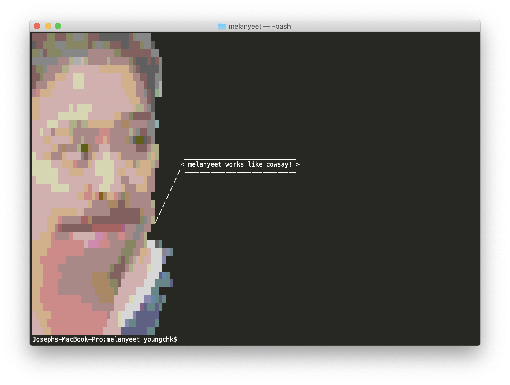

# melanyeet
A gag unix command for my good friend melanie.



## Requirements

- Installation of `python`
- Installation of `cowsay`

## Installation

Python can be installed from the official site, and cowsay can be installed using `apt-get` or `homebrew`.
Once the requriements have been installed, clone the reposiotry and run the installation script:
```
git clone https://github.com/qwewy/melanyeet.git
cd melanyeet
./install.sh
```

## Usage

Use `melanyeet` by passing in arguments directly:
```
melanyeet Hello World!
```
or by piping an input through stdin:
```
echo "Hello World!" | melanyeet
```

Try using it with `fortune` for some wise words:
```
fortune | melanyeet
```

Or try passing in the `--brother` flag!
```
melanyeet --brother
```
